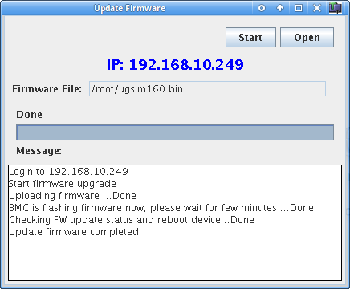

# X7DBT
Some notes about IPMI on X7DBT mother boards.

## Firmware upgrade

### With IPMIView
IPMIView version 2.10.2 can be found on [SuperMicro's FTP - ftp://ftp.supermicro.com/utility/IPMIView/](ftp://ftp.supermicro.com/utility/IPMIView/)

1. Select the server in IPMIView left tab and go the File menu > Update Firmware
 

2. Confirm that you have the correct firmware
 

3. Be sure to have the file on the server which runs IPMIView
 

4. And upload the firmware file `ugsim160.bin`
 

5. Start the flashing process
 

6. Enter the server's IPMI credentials
 

7. Confirm the process
 

8. Wait for it
 

9. Until it completes
 

10. And it confirms with a success message
 

11. Close the window
 

12. And connect to the server to check the firmware version in the IPM Device tab
 

### With IPMItools (cli)
@TODO

### With IPMI web interface
@TODO

## AOC-SIMSO(+)
| Name                   | Infos           |
| ---------------------: |:----------------|
| Description            | IPMI 2.0 with Virtual Media Over LAN & Dedicated LAN |
| Connector on Card      | Mini USB with 8" Cable for Dedicated LAN (+) |
| Dimensions             | 2.7" x 1.7"     |
| Compatible Motherboard | PDSMU, X7DBR-3, X7DBR-8, X7DBR-8+, X7DBR-E, X7DBR-i, X7DBR-i+, __X7DBT__, X7DBT-INF, X7DBU, H8QM8-2, H8QME-2, H8QM8-2+, H8QME-2+, H8DMU+, H8SMU |
| Optimized Chassis      | 1U and Above    |
| Bracket                | -               |
| Download               | User's Guide : http://www.supermicro.com/manuals/other/AOC-SIMSO.pdf |
|                        | Driver : ftp://ftp.supermicro.com/CDR-SIMIPMI_1.13_for_SIM_IPMI/ |
|                        | Driver CD Image : ftp://ftp.supermicro.com/CDR_Images/CDR-SIMIPMI_1.13_for_SIM_IPMI.iso |

## Notes
* http://www.supermicro.com/products/accessories/addon/SIM.cfm
* http://www.supermicro.com/products/motherboard/Xeon1333/5000P/X7DBT-INF.cfm
* http://www.supermicro.com/products/motherboard/Xeon1333/5000P/X7DBT.cfm
* https://twiki.cern.ch/twiki/bin/view/FIOgroup/IpmiFirmwareUpgradeSupermicroX7
* https://forum.likg.org.ua/ipmi/update-ipmi-firmware-on-supermicro-x7xxx-x8xxx-motheboards-t354.html
